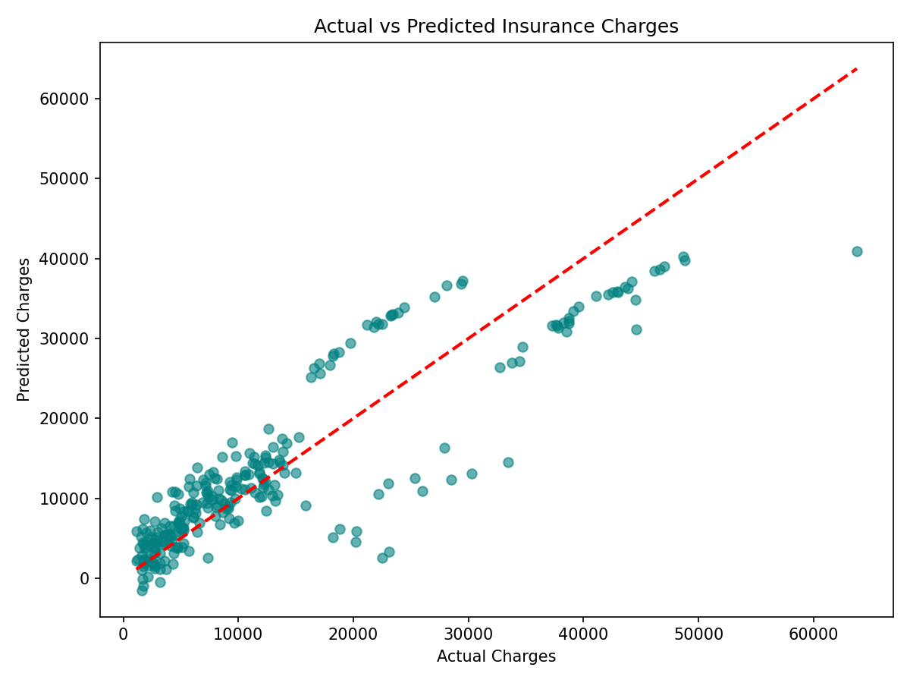

# Medical Insurance Cost Prediction using Multiple Linear Regression

## Objective
To build a Multiple Linear Regression model that predicts an individual's medical
insurance charges based on personal and health-related attributes such as age, sex,
BMI, number of children, smoking status, and region.

## Dataset
Medical Cost Personal Insurance Dataset (Kaggle):
https://www.kaggle.com/datasets/mirichoi0218/insurance

*(Dataset is not included in this repository — download it from the Kaggle link above
and place `insurance.csv` in the project root before running the notebook.)*

## Libraries Used
- pandas
- numpy
- matplotlib
- scikit-learn (train_test_split, LinearRegression, metrics)

## Methodology
1. **Data Understanding** – Loaded the dataset, inspected the first five records, and
   identified numerical features (age, bmi, children), categorical features
   (sex, smoker, region), and the target variable (charges).
2. **Data Preprocessing** – Checked for missing values (none found), encoded the
   categorical variables (`sex` and `smoker` as binary labels, `region` via one-hot
   encoding), and split the data into 80% training and 20% testing sets.
3. **Model Development** – Trained a Multiple Linear Regression model on the encoded
   features to predict `charges`, then generated predictions on the test set.
4. **Model Evaluation** – Evaluated the model using MAE, MSE, and R² score, and
   visualized performance with an Actual vs Predicted scatter plot.

## Results
| Metric | Value |
|---|---|
| MAE | 4181.19 |
| MSE | 33,596,915.85 |
| R² Score | 0.7836 |

**Observations:**
- The model explains roughly 78% of the variance in insurance charges, indicating a
  reasonably good linear fit.
- `smoker` status has by far the largest coefficient magnitude, making it the single
  strongest predictor of higher charges.
- The model tends to underestimate charges for a cluster of high-cost individuals
  (typically smokers with high BMI), suggesting the true relationship is not purely
  linear.

## Conclusion
This project built a Multiple Linear Regression model to predict medical insurance
charges using age, sex, BMI, number of children, smoking status, and region. The model
achieved a good fit on the test data (R² ≈ 0.78), with smoking status emerging as the
single most influential factor in determining charges, followed by age and BMI. Region
and sex had comparatively minor effects. These findings align with real-world
expectations, since smoking and obesity are well-known health risk factors that
insurers price heavily into premiums. However, a key limitation of Linear Regression
here is its assumption of a linear relationship between features and charges; in
reality, the interaction between smoking, BMI, and age produces charges that grow
non-linearly, causing the model to underestimate costs for high-risk individuals. A
more flexible model, such as a polynomial or tree-based regression, could potentially
capture these interactions more accurately.
