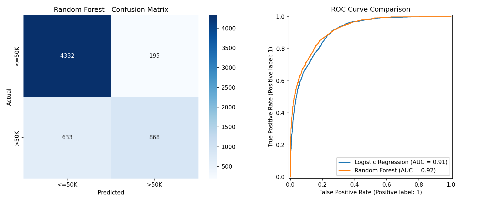
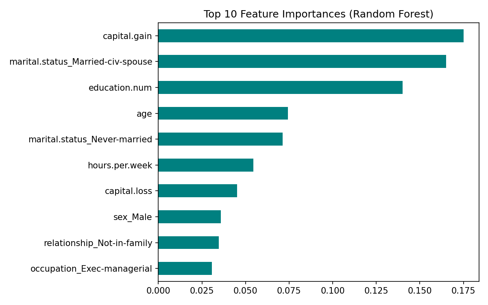

# Adult Census Income Classification

## Objective
Predict whether an individual's annual income exceeds $50K based on 1994 US Census
demographic data (age, education, occupation, marital status, hours worked, etc.).

## Dataset
Adult Census Income Dataset (UCI Machine Learning Repository / Kaggle):
https://archive.ics.uci.edu/dataset/2/adult

*(Dataset is not included in this repository — download `adult.csv` from the link
above and place it in the project root before running the notebook.)*

## Libraries Used
- pandas, numpy
- matplotlib, seaborn
- scikit-learn (LogisticRegression, RandomForestClassifier, preprocessing, metrics)

## Methodology
1. **Data Understanding** – Loaded 32,561 records across 15 columns; examined the class
   balance of the target (`income`: ~76% `<=50K`, ~24% `>50K`).
2. **Data Cleaning** – Replaced `'?'` placeholders in `workclass`, `occupation`, and
   `native.country` with NaN and dropped incomplete rows (~7% of data), then removed
   duplicates, leaving 30,139 clean records.
3. **EDA** – Visualized age distribution, income class balance, and income by
   education level.
4. **Feature Engineering** – Dropped `education` (redundant with `education.num`) and
   `fnlwgt` (a census sampling weight); one-hot encoded categorical variables; scaled
   numeric features; split into 80% train / 20% test (stratified).
5. **Model Training** – Trained and compared Logistic Regression (linear baseline) and
   Random Forest (non-linear ensemble).
6. **Evaluation** – Compared models using Accuracy, Precision, Recall, F1, and ROC-AUC;
   inspected the Random Forest confusion matrix, ROC curve, and feature importances.

## Results

| Model | Accuracy | Precision | Recall | F1 | ROC-AUC |
|---|---|---|---|---|---|
| Logistic Regression | 0.852 | 0.745 | 0.618 | 0.676 | 0.909 |
| **Random Forest** | **0.863** | **0.817** | 0.578 | 0.677 | **0.919** |

Random Forest classification report (test set):
- `<=50K`: precision 0.87, recall 0.96, f1 0.91
- `>50K`: precision 0.82, recall 0.58, f1 0.68
- Overall accuracy: 0.86

**Observations:**
- Random Forest outperforms Logistic Regression on every metric, especially ROC-AUC,
  showing it captures non-linear feature interactions the linear model misses.
- `marital.status`, `capital.gain`, `age`, and `education.num` are the strongest
  predictors of higher income.
- Because the classes are imbalanced (~76/24 split), recall on the `>50K` class is
  noticeably lower than on `<=50K` — the model is more conservative about predicting
  the minority (high-income) class.

## Conclusion
This project classified individuals' income level (`<=50K` vs `>50K`) using 1994 US
Census demographic data. After cleaning missing values encoded as `'?'` and engineering
categorical features, both Logistic Regression and Random Forest models were trained
and compared. The Random Forest model achieved the stronger overall performance, with
marital status, capital gains, age, and education level emerging as the most
influential predictors of higher income. These results reflect intuitive real-world
patterns: higher education and more work experience (age) correlate with higher
earnings, and capital gains often indicate existing wealth. A key limitation is class
imbalance in the target variable, which biases the model toward the majority class
(`<=50K`) and lowers recall on high earners — an issue that could be addressed with
class weighting, oversampling (e.g. SMOTE), or threshold tuning in future work.
